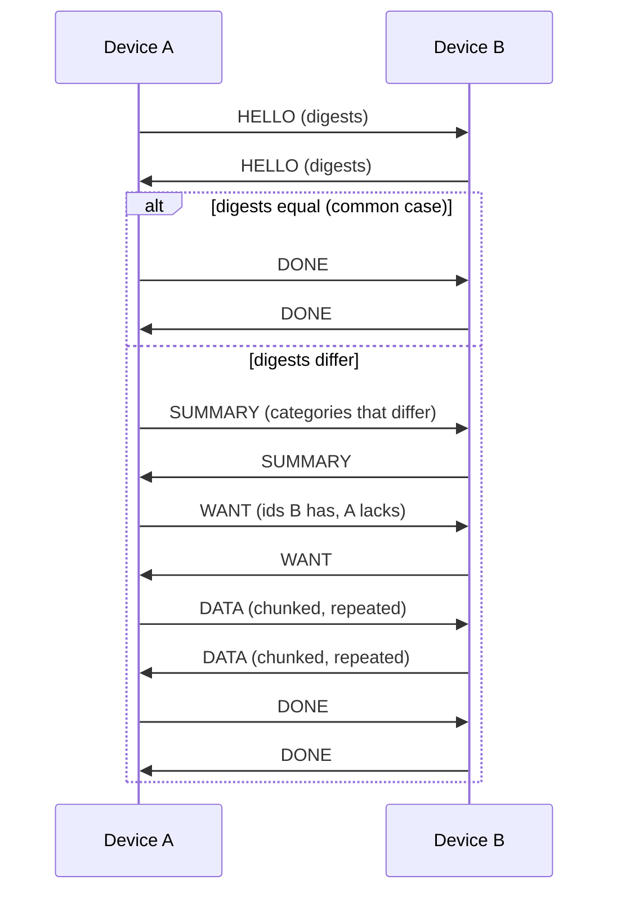

# Device Sync, Simplified (Draft)

## Goal

One Marmot account on N devices, all converging on the same state:
messages, group/community membership, and published keypackages. No new
server infrastructure; devices talk directly over a private mesh.

## Roles

- **Master**: the first device the account is created on. It creates the
  mesh network and issues join credentials. Master is an *administrative*
  role (invites, revocation), not a data authority: sync itself is
  peer-to-peer and symmetric.
- **Member**: any other device that joined the mesh. Full sync peer.

If the master is lost, the account still works; a new master can be
promoted (out of scope for v1).

## Mesh layer: nostr-vpn

Devices form a private overlay using nostr-vpn
(<https://github.com/mmalmi/nostr-vpn>): peers hold Nostr keypairs,
discover and signal each other via relays, and establish end-to-end
encrypted tunnels. From this spec's perspective the mesh provides:

- an authenticated, encrypted IP tunnel between any two member devices,
- a stable per-device mesh identity (the device's Nostr pubkey),
- NAT traversal and reconnection.

Each device runs its own TCP listener on its mesh address; a sync
session is one TCP connection over the tunnel. The tunnel supplies
authentication and encryption; the sync protocol adds no crypto of its
own.

### Joining

1. Master displays a QR code containing: mesh network id, a one-time
   join secret, and relay hints for signaling.
2. New device scans it, connects to the master over the mesh, proves
   possession of the join secret, and sends its device pubkey.
3. Master adds the pubkey to the member list and gossips the updated
   list to all members.

Join secrets are single-use and expire (suggested: 10 minutes).

### Leaving

- Voluntary: device sends `BYE` and stops connecting.
- Revocation: master removes the pubkey from the member list and gossips
  the update. Members drop connections from removed pubkeys.

A removed device keeps the data it already synced; that is inherent to
any sync design and is handled at the MLS layer (key rotation on device
removal), not here.

## Sync protocol

Periodic anti-entropy between pairs of devices. Every device runs the
same logic; there is no client/server distinction inside a session.

- Trigger: on connect, then every `SYNC_INTERVAL` (suggested: 60 s),
  plus immediately after local writes (debounced).
- Transport: one TCP connection over the mesh tunnel per session.

### Data categories

| Tag | Category | Item id | Merge rule |
| --- | --- | --- | --- |
| 0x01 | `MSG` (application/group messages) | message id | set union (immutable items) |
| 0x02 | `GRP` (group/community membership + metadata) | group id | last-write-wins by (epoch, timestamp) |
| 0x03 | `KP` (published keypackages) | keypackage ref | set union + tombstones for consumed ones |
| 0x04 | `DEV` (mesh member list) | device pubkey | master-signed, highest version wins |

Tag values are fixed for `ver = 1`. A frame carrying an unassigned tag
is a protocol error.

Item ids here are sync-internal handles. Note `GroupId` is opaque MLS
bytes; do not conflate with 32-byte `nostr_group_id` routing handles.

### Framing

All integers little-endian. Every frame:

```
+--------+--------+----------------+-----------+
| u8 ver | u8 typ | u32 len        | payload   |
+--------+--------+----------------+-----------+
```

`ver = 1`. Max `len`: 1 MiB; larger data is chunked into multiple `DATA`
frames. Unknown `typ` in a same-`ver` frame is a protocol error (close
the session); a higher `ver` than supported closes with `ERR`.

### Frame types

| typ | Name | Payload |
| --- | --- | --- |
| 0x01 | `HELLO` | u64 state_version, u8 category_count, per category: u8 tag, u32 item_count, 32-byte digest |
| 0x02 | `SUMMARY` | per category: u8 tag, u32 count, then `count` × (item id, 32-byte item hash) |
| 0x03 | `WANT` | per category: u8 tag, u32 count, then `count` × item id |
| 0x04 | `DATA` | u8 tag, item id, u32 chunk_index, u32 chunk_total, bytes |
| 0x05 | `DONE` | u64 new state_version |
| 0x06 | `BYE` | empty |
| 0x7F | `ERR` | u16 code, utf-8 message |

Item ids are length-prefixed (`u16 len` + bytes) since `GroupId` is
variable-length.

### Hashing and canonicalization

All hashes are SHA-256; every 32-byte digest and item hash in the frame
tables is a SHA-256 output. Domain separation keeps item hashes and
category digests from colliding across contexts:

```
item_hash       = SHA-256("mdk-sync-v1:item:"   || tag || item_id || payload)
category_digest = SHA-256("mdk-sync-v1:digest:" || tag || h_1 || h_2 || ... || h_n)
```

where `tag` is the category's u8 value, `item_id` is the length-prefixed
id exactly as framed, `payload` is the item's canonical bytes, and
`h_1..h_n` are the category's item hashes sorted ascending bytewise. An
empty category's digest is the hash of the prefix and tag alone (n = 0).

Canonical bytes rule: the payload transmitted in `DATA` frames IS the
canonical serialization; item hashes are computed over those exact
bytes, so there is no separate re-serialization step to disagree on.
Each category's payload encoding is deterministic:

- Fields appear in a fixed order defined per category, with no optional
  omission; fixed-width integers are little-endian, variable-length
  fields are `u16 len` prefixed, timestamps are u64 unix seconds.
- An optional field is a u8 presence flag followed by the value when
  the flag is 1. A `KP` tombstone is a u8 consumed flag.
- Any set-valued field (for example the `DEV` member list) is sorted
  ascending bytewise before encoding.

`DEV` signatures are BIP-340 Schnorr (as in Nostr) by the master key,
computed over the canonical payload bytes excluding the signature field
itself.

Convergence check: two devices holding the same items MUST produce
identical category digests. Conformance vectors pin this: fixed item
sets with expected payload bytes, item hashes, and digests.

### Session flow



Category digest = hash of sorted item hashes, so equal digests skip the
category entirely. Steady state is two `HELLO` frames per interval.

### Merge

Applied per category rule (table above), after validation:

- `MSG`: insert if unknown; duplicates dropped by id.
- `GRP`: accept if (epoch, timestamp) newer than local; MLS validity is
  checked by the engine before commit; sync never bypasses it.
- `KP`: union; a tombstone (consumed marker) beats presence.
- `DEV`: verify master signature, accept if version higher.

Merges are torn-write-free per the multi-step-state-changes invariant:
validate the full incoming batch, apply transactionally per category.

## Security notes

- Trust boundary is mesh membership: any member can send any frame, so
  every payload is validated before merge (signature checks, MLS epoch
  checks, size limits). Malformed input gets `ERR` + close, never a crash.
- Join secret over QR is the enrollment root of trust; it never
  transits a relay in cleartext (it rides the QR, then a mesh tunnel).
- Sync tracing follows the observability rules: aggregate counts only,
  no ids, pubkeys, or payloads.
- Relay dialing inherits the dial-safety discipline
  (`reject_non_public_ip`, retired-relay denylist).

## Out of scope (v1)

- Master promotion / recovery after master loss.
- Partial sync (per-group selective sync); v1 syncs everything.
- Bandwidth-optimized set reconciliation (merkle ranges, IBLT).
- Multi-account devices; one mesh per account-device identity, matching
  the one-database-per-identity storage rule.
