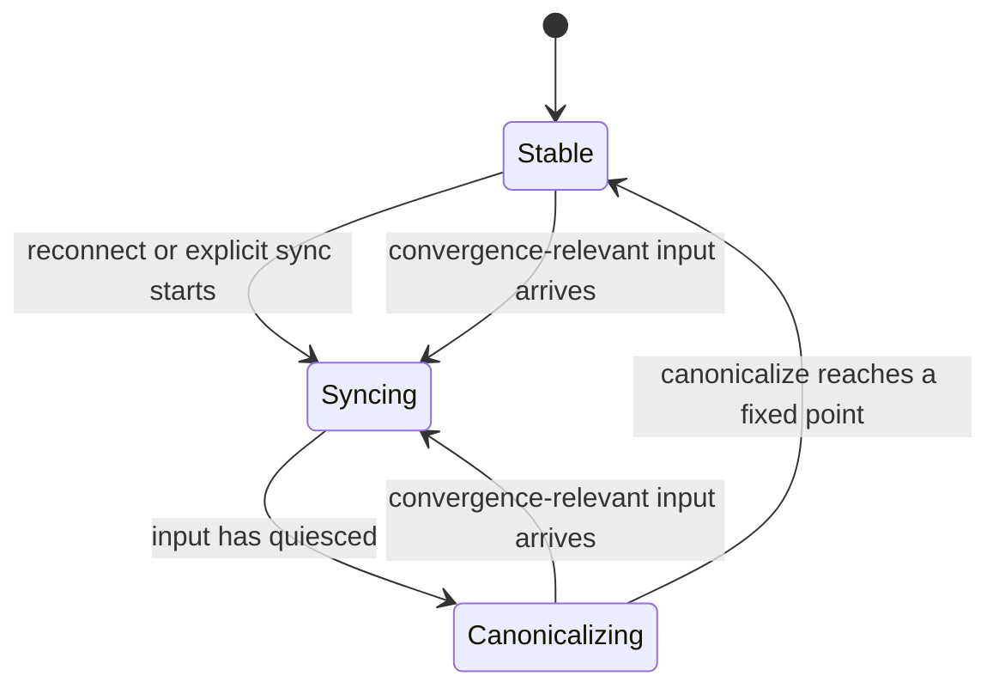
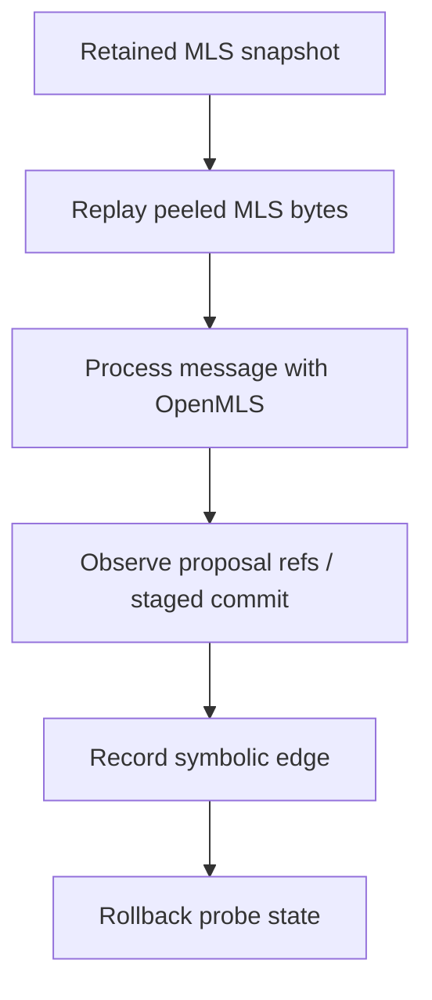
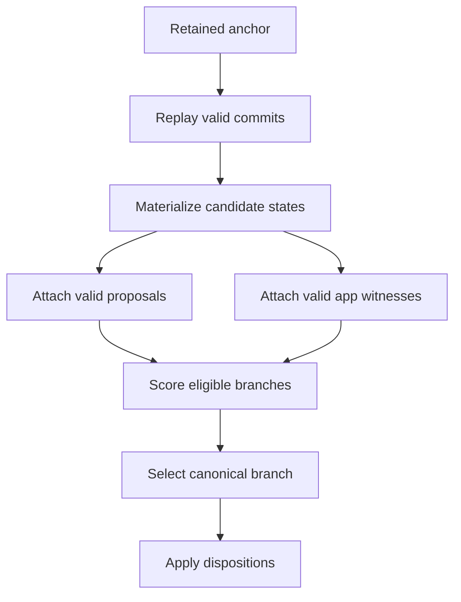

# CGKA Engine Canonicalization Contract

**Status:** draft contract. This document defines the post-peeling
canonicalization boundary for the CGKA engine.

## Scope

This contract starts after transport peeling. Inputs are transport-independent
messages for a known group. Nostr event ids, relay order, relay timestamps, and
local arrival order are not consensus inputs.

The transport layer may buffer, retry, and fetch from relays. The CGKA engine
receives peeled messages and decides which protocol artifacts become canonical.
Any ordering supplied by the transport adapter is advisory. The engine may use
it as input order for buffering, but branch selection depends on MLS replay,
retained anchors, and the negotiated policy.

The handoff is:

```text
transport adapter -> peeler -> CGKA engine canonicalization -> application events/results
```

The application consumes accepted app messages and invalidation records after
canonicalization. It does not decide which commit branch is canonical.

The contract has one logical operation:

```text
canonicalize(engine_state, pending_messages, outbound_intents, policy, clock)
  -> CanonicalizationResult
```

Implementations may call this operation after each ingest, after a sync batch,
after relay input becomes idle, or on demand. The result MUST be the same for
the same inputs, retained anchor, policy, engine version, and lifecycle clock
state.

## Core Invariant

Two honest engines with the same retained anchor, the same pending set, the
same negotiated policy, and the same engine version MUST produce the same
canonical branch and the same protocol message dispositions.

```text
same anchor
+ same retained candidate states
+ same pending messages
+ same policy
+ same engine version
= same CanonicalizationResult
```

The canonical branch is selected by protocol evidence. Local arrival order is
only an implementation detail.

Lifecycle outputs also depend on local monotonic time. `sync_state` is a
derived result, not an input claim. `sync_state` and
`publishable_outbound_messages` are deterministic when engines also have the
same `last_convergence_relevant_input_time`, `stable_quiescence_ms`, and
current monotonic clock reading.

## Lifecycle

The engine tracks a sync state:



States:

- `Syncing`: the engine is collecting peeled messages. Outbound app messages and
  group changes MUST be queued as intents.
- `Canonicalizing`: the engine is building candidate states, scoring branches,
  applying the selected branch, and assigning message dispositions.
- `Stable`: the engine has seen no convergence-relevant input for at least the
  configured quiescence duration and the last canonicalization pass reached a
  fixed point.

Convergence-relevant input includes commits, proposals, and app messages that
can affect branch witness scores. Pure duplicate messages do not reset the
quiescence timer.

`stable_quiescence_ms` MUST be tunable. Groups SHOULD publish a recommended
value. Clients MAY choose a longer local value, but MUST NOT choose a value
below a group-required minimum. A value that is too high can pin clients in
`Syncing`; a value that is too low can cause avoidable forks. Conformance tests
SHOULD model both failure modes.

The branch selection function itself MUST NOT depend on wall-clock time. Time
only gates when the engine is willing to publish outbound work.

The `clock` input MUST be local monotonic time. Wall-clock time MUST NOT affect
branch selection.

## Inputs

`pending_messages` contains peeled protocol messages. Each message has:

```text
PeeledMessage {
  message_id,
  group_id,
  sender,
  kind: Commit | Proposal | AppMessage,
  source_epoch,
  mls_bytes,
}
```

`message_id` is a transport-independent dedupe key. It MAY be a digest of the
peeled protocol bytes. It MUST NOT be a Nostr event id.

The executable conformance model uses symbolic commit edge metadata so it can
test graph construction without OpenMLS:

```text
CommitEdge {
  branch_id,
  parent_branch_id: Option<BranchId>,
  fork_epoch,
  resulting_epoch,
  tip_digest,
  consumed_proposal_ids,
}
```

Production engines MUST derive the parent relation and resulting state by MLS
replay. They MUST NOT trust transport-provided parent metadata.

OpenMLS integration is bytes-first. The engine MUST retain peeled MLS bytes and
derived observations, not long-lived OpenMLS protocol objects. OpenMLS
`ProtocolMessage`, `QueuedProposal`, and `StagedCommit` values are consumed by
processing and merge APIs.

Candidate-state exploration therefore runs against retained state snapshots:



For commits that cover proposals, production engines derive
`consumed_proposal_ids` from OpenMLS `ProposalRef` values exposed on
`StagedCommit::queued_proposals()` before calling `merge_staged_commit`.

The replay output is the bridge into branch selection:

```text
OpenMLS replay observations
  -> materialized candidate { fork_epoch, tip_epoch, tip_digest, consumed refs }
  -> BranchCandidate
  -> convergence selector
```

The executable contract exposes this as materialized candidate input to
canonicalization. Candidate metadata supplies commit ids and consumed proposal
ids, while ordinary `pending_messages` still supplies proposals and application
messages whose dispositions need to be reported.

The OpenMLS replay bridge MUST translate consumed `ProposalRef` values back to
the canonical proposal `message_id` before reporting proposal dispositions.
When replay processes an application message on a candidate branch, that
observation supplies the app message's decrypting branch set, sender, epoch, and
stored payload reference for witness scoring and invalidation reporting.
Candidate paths SHOULD be commit paths. The replay bridge is responsible for
probing pending proposals before those commits and probing pending application
messages after the candidate state is materialized. An application message that
does not decrypt on a candidate branch is ignored for that branch, not treated
as a branch materialization failure.

`outbound_intents` contains local work the application wants to publish:

```text
OutboundIntent =
  SendAppMessage(payload)
| CreateCommit(change)
| PublishProposal(proposal)
```

The engine MUST queue outbound intents while it is not `Stable`.

## Policy

The convergence policy is a group policy. Unsupported policy is a capability
mismatch.

```text
ConvergencePolicy {
  max_rewind_commits: 5,
  app_message_past_epoch_limit: FromMlsConfiguration,
  stable_quiescence_ms,
  witness_quorum,
  max_witness_override_depth,
}
```

`max_rewind_commits` defaults to 5 and is normative for v0 groups unless the
group negotiates another value.

Engines MUST persist the negotiated policy per group. After restart, the engine
MUST load the stored group policy before computing retained anchors, pruning
snapshots, selecting candidate branches, or deciding whether a stale commit is
inside the rewind horizon. A local default is only a fallback for groups that do
not yet have a stored policy.

The same value bounds retained anchor snapshots. At current tip `T`, the
oldest retained anchor is:

```text
oldest_retained_anchor = T - max_rewind_commits
```

Engines MUST retain snapshots for the current tip and every epoch at or after
that anchor. Engines MUST prune older retained anchors after a successful
canonicalization pass advances the current tip.

`app_message_past_epoch_limit` MUST follow the MLS configuration used by the
engine for decrypting past-epoch application messages. App messages outside
that limit are discarded or reported as expired. The engine MUST NOT invent a
separate app-message rewind horizon.

`witness_quorum` SHOULD be derived from active group size. The exact function
is part of group policy:

```text
DerivedWitnessQuorum {
  min_senders_per_epoch,
  max_senders_per_epoch,
  sender_fraction_bps,
  required_epochs,
}

witness_quorum_senders_per_epoch =
  clamp(
    ceil(active_members_at_epoch * sender_fraction_bps / 10000),
    min_senders_per_epoch,
    max_senders_per_epoch
  )
```

The derived sender count is evaluated per epoch against that epoch's active
membership. This keeps the rule deterministic across membership changes.

## Candidate-State Graph

The engine builds a bounded candidate-state graph from the retained anchor.



Rules:

- A commit creates an edge when it validates against exactly one parent
  candidate state.
- A child commit whose parent candidate is unavailable remains pending until
  that parent appears or the commit expires.
- A commit at or after the retained anchor MAY be replayed from the retained
  snapshot for its source epoch.
- A commit that forks before the retained anchor or beyond
  `max_rewind_commits` MUST be discarded.
- A commit whose source epoch is older than the retained anchor MUST be dropped
  with `BeyondAnchor` and persisted as invalidated.
- If a commit needs a retained snapshot that is no longer present, the engine
  MUST return `MissingRetainedAnchor` and MUST NOT mutate group state or the
  commit's message state.
- A commit that validates against no candidate state remains pending until it
  expires or a parent state appears.
- A commit that validates against more than one candidate state is a protocol
  error unless the MLS layer proves those states are identical.
- Candidate states outside the retention horizon MUST be dropped.

Branch scoring follows
[`distributed-convergence.md`](./distributed-convergence.md):

1. Higher effective commit depth.
2. Witness quorum beats no quorum.
3. Higher raw commit depth.
4. Higher app-witness score.
5. Lower tip commit digest.

## Proposals

Proposals are pending artifacts until a canonical commit consumes them.

Rules:

- A proposal is canonical only if a canonical commit consumes it.
- A proposal on a losing branch MUST be dropped.
- A proposal older than the retained anchor MUST be dropped.
- Duplicate proposals MUST be reported as `AlreadySeen`.
- A proposal that is valid but not yet consumed MAY remain pending until it
  expires by policy.
- In the conformance model, proposal consumption is represented by symbolic
  `consumed_proposal_ids` on commit edges. Production engines derive the same
  relation from MLS replay by observing `ProposalRef`s on the staged commit
  before OpenMLS consumes it during merge.

The engine SHOULD expose proposal disposition to callers when applications need
to explain why a requested group change did not apply.

## Application Messages

Application messages are not the commit log. They are processed in their MLS
epoch, then the application orders payloads with its own message timestamp.

An app message can still witness branch usage if it decrypts against a
candidate state. Witness counting uses distinct senders per epoch.

Rules:

- An app message that decrypts against the selected branch and is within the
  MLS past-epoch decryption limit is accepted.
- Accepted app messages MUST become application-visible
  `GroupEvent::MessageReceived` outputs after the selected canonical commit
  path has been applied.
- An app message that decrypts against multiple candidate states is accepted
  only if one matching state is on the selected branch. If no matching state is
  selected, it is invalidated.
- An app message that decrypts only against a losing branch is invalidated.
- An app message older than the MLS past-epoch decryption limit is expired.
- Duplicate app messages MUST be reported as `AlreadySeen`.
- If the engine decrypted and stored the payload before invalidation, the
  invalidation result MUST retain a reference to that stored payload.

Invalidated app messages use this shape:

```text
InvalidatedAppMessage {
  message_id,
  epoch,
  reason: LosingBranch | BeyondAnchor | BeyondAppRetention | UndecryptableInCanonicalState,
  decrypted_payload_ref: Option<PayloadRef>,
}
```

Applications decide whether to hide, mark, or surface invalidated messages.
The engine reports protocol disposition through
`GroupEvent::AppMessageInvalidated`; it MUST NOT emit an invalidated message as
`GroupEvent::MessageReceived`.

## Outbound Intents

Outbound work is gated by sync state.

Rules:

- While `Syncing` or `Canonicalizing`, outbound intents MUST be queued.
- App-message intents are encrypted only after the engine is `Stable`.
- Commit intents MUST be regenerated after the engine becomes `Stable`.
- Proposal intents MAY be retained while syncing, but MUST be revalidated
  before publish.
- If an outbound intent targets an epoch older than the selected state, the
  engine MUST return an error and leave publishing to the application.

The engine MUST NOT publish a commit or app message from an MLS state that was
created before the latest successful canonicalization pass.

On the application-facing engine API, a queued local send is reported as:

```text
SendResult::Queued {
  group_id,
  intent_id,
}
```

`intent_id` identifies the durable queued intent. Applications drive the
release path with:

```text
advance_convergence(group_id) -> Vec<SendResult>
```

When the group reaches `Stable`, the engine regenerates publishable messages
from the selected canonical state and removes each queued intent after
regeneration succeeds. If regeneration creates a commit, the engine returns
that one `SendResult::GroupEvolution` and pauses further draining until the
application reports `confirm_published` or `publish_failed`. Calling
`advance_convergence` during that pending-publish window returns no publishable
work.

## Result

`CanonicalizationResult` reports the complete disposition of work handled in the
pass.

```text
CanonicalizationResult {
  previous_tip,
  selected_tip,
  selected_branch_id,
  sync_state,
  accepted_commits,
  accepted_proposals,
  accepted_app_messages,
  invalidated_app_messages,
  dropped_messages,
  already_seen,
  queued_outbound_intents,
  publishable_outbound_messages,
  errors,
}
```

`AlreadySeen` is observable:

```text
AlreadySeen {
  message_id,
  kind: Commit | Proposal | AppMessage,
}
```

Dropped messages use explicit reasons:

```text
DroppedMessage {
  message_id,
  kind,
  reason:
    BeyondRollbackHorizon
  | BeyondAnchor
  | BeyondAppRetention
  | InvalidAgainstCandidateState
  | UnsupportedPolicy
  | Malformed,
}
```

## Storage Requirements

The engine MUST persist enough state to reproduce canonicalization after a
restart.

Required storage:

- negotiated convergence policy and engine version, stored per group and loaded
  before convergence after restart,
- finalized anchor and anchor epoch,
- retained Marmot and OpenMLS epoch snapshots from the current tip back through
  `max_rewind_commits`,
- canonical commit sequence from the anchor to the selected tip,
- pending commits that may still become valid,
- pending proposals not yet consumed or expired,
- app messages within the MLS past-epoch decryption limit,
- durable transport message records for retained commit, proposal, and
  application-message inputs, including enough bytes to reconstruct the same
  OpenMLS replay batch after restart,
- decrypted app payloads retained by application policy,
- invalidation records for messages already surfaced to the application,
- dedupe index for commits, proposals, and app messages,
- queued outbound intents,
- last successful canonicalization result,
- last convergence-relevant input time for sync quiescence.

Storage MAY discard candidate states, pending messages, and app payloads outside
their negotiated retention horizons. Once discarded, those artifacts cannot
cause rollback or app-message acceptance.

When storage discards a retained anchor, later commits that require that anchor
fall into one of two outcomes: `MissingRetainedAnchor` if the commit is still
inside the configured rewind window but the snapshot is absent, or `BeyondAnchor`
if the commit is older than the retained anchor.

## Error Handling

Canonicalization errors are local engine results. They do not mutate group
state unless a canonical branch is selected and applied.

Required errors:

```text
CanonicalizationError =
  UnsupportedPolicy
| MissingRetainedAnchor
| CandidateStateUnavailable
| MlsValidationFailed
| OutboundIntentStale
| StorageUnavailable
```

The engine SHOULD continue processing independent messages when one message
fails validation.

## Conformance Scenarios

The conformance suite should cover:

- same pending set in different arrival orders yields the same result,
- equal-depth fork resolved by app witnesses,
- witness quorum overriding a small private branch lead,
- witness quorum failing to override a larger commit-depth lead,
- commit edges materialized into candidate branches before selection,
- child commit delivered before parent still materialized after parent appears,
- child commit with missing parent left pending,
- proposal consumed by canonical commit,
- proposal not consumed by a canonical commit left pending,
- proposal on losing branch dropped,
- app message on losing branch invalidated with payload reference when known,
- end-to-end peeler ingest emits only canonical application `GroupEvent`
  output and losing-branch invalidation events across multiple clients
  (`convergence-e2e-group-events/v1`),
- generated `convergence-e2e-delivery/v1` variants preserve that output under
  duplicated, delayed, and reordered queued delivery,
- app message beyond MLS past-epoch retention expired,
- commit beyond `max_rewind_commits` discarded,
- late same-epoch commit inside the retained anchor window replayed from the
  retained snapshot,
- late same-epoch commit with a missing retained snapshot reported as
  `MissingRetainedAnchor` without mutation,
- commit older than the retained anchor dropped as `BeyondAnchor` and persisted
  as invalidated,
- duplicate commit, proposal, and app message reported as `AlreadySeen`,
- outbound app-message intent queued during `Syncing`,
- outbound commit intent regenerated after `Stable`,
- `stable_quiescence_ms` too low producing extra forks in simulation,
- `stable_quiescence_ms` too high pinning outbound work in simulation,
- restart from persisted storage reproduces the same result.

## Relationship To Other Docs

[`distributed-convergence.md`](./distributed-convergence.md) defines the branch
selection model. This contract defines how the CGKA engine packages that model
as a state-machine operation with inputs, outputs, lifecycle, and storage.

The current executable policy model lives in
[`crates/cgka-engine/src/convergence.rs`](../../crates/cgka-engine/src/convergence.rs).
The executable canonicalization contract model lives in
[`crates/cgka-engine/src/canonicalization.rs`](../../crates/cgka-engine/src/canonicalization.rs).
The current Tamarin model lives in
[`formal/tamarin/distributed_convergence_v0.spthy`](../../formal/tamarin/distributed_convergence_v0.spthy)
and includes the delivery-order robustness contract for the generated
`convergence-e2e-delivery/v1` variants.
The contract scenario tests live in
[`crates/cgka-conformance-simulator/tests/canonicalization_contract.rs`](../../crates/cgka-conformance-simulator/tests/canonicalization_contract.rs).
