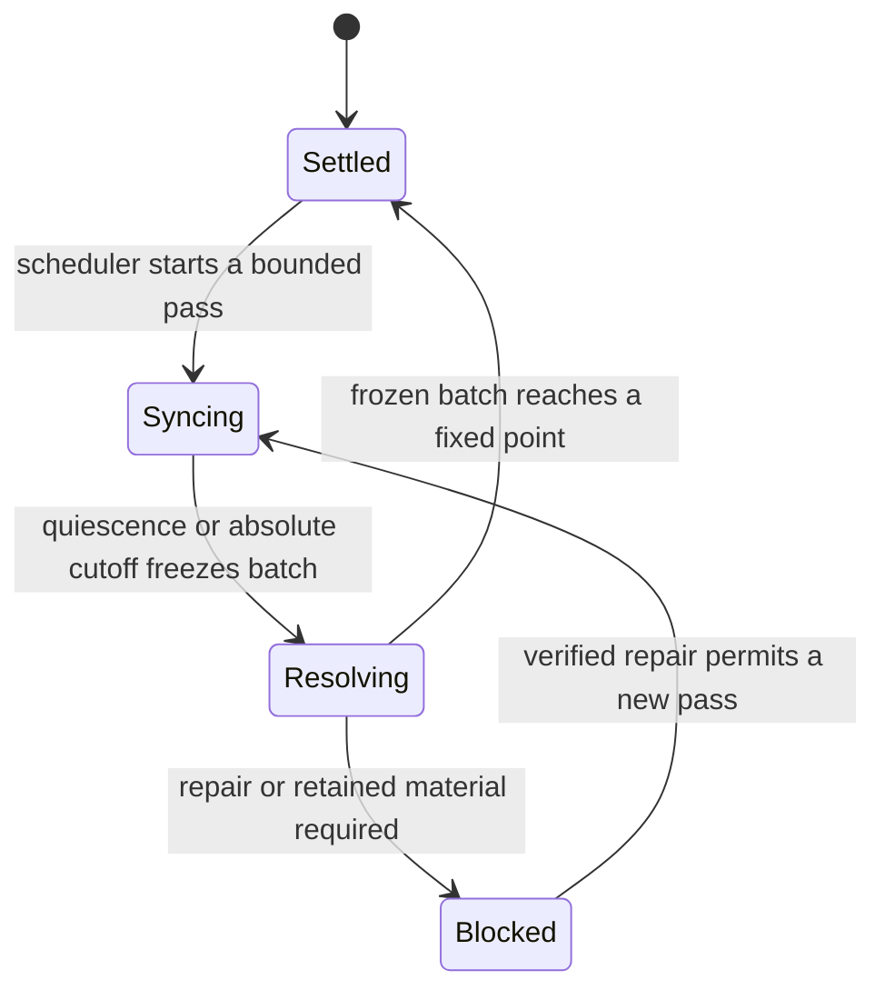
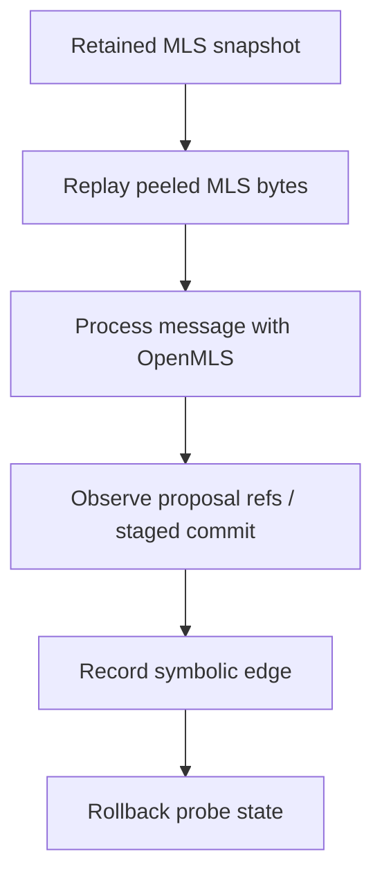
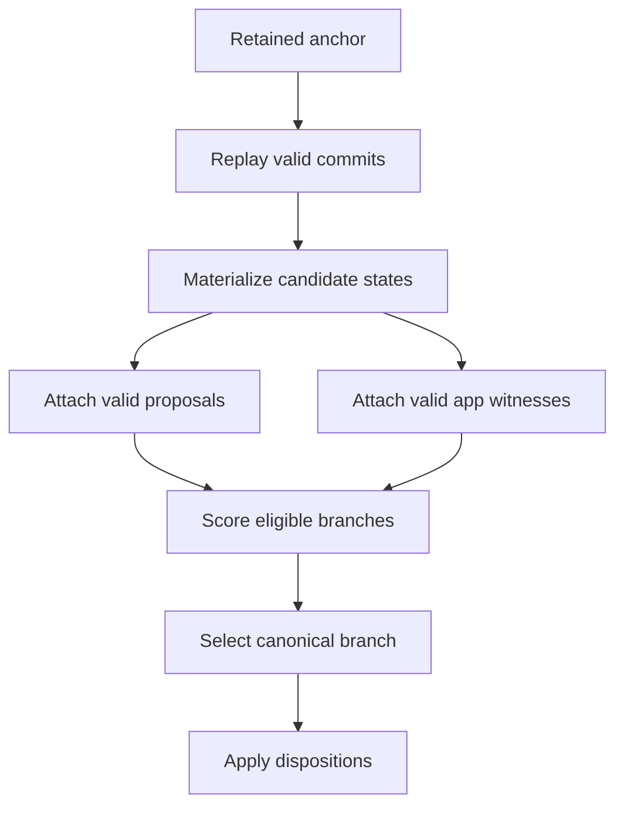

# CGKA Engine Canonicalization Contract

**Status:** adopted-protocol binding. This document defines MDK's executable post-peeling boundary for the adopted
Marmot convergence and conformance contracts. Normative behavior lives in
[`marmot-protocol/marmot`](https://github.com/marmot-protocol/marmot); Rust result shapes, storage states, and diagnostic
fields documented here are MDK implementation surface.

## Scope

This contract starts after transport peeling. Inputs are transport-independent messages for a known group. Nostr event
ids, relay order, relay timestamps, and local arrival order are not consensus inputs.

The transport layer may buffer, retry, and fetch from relays. The CGKA engine receives peeled messages and decides which
protocol artifacts become canonical. Any ordering supplied by the transport adapter is advisory. The engine may use it
as input order for buffering, but branch selection depends on MLS replay, retained anchors, and the pinned protocol
policy.

The handoff is:

```text
transport adapter -> peeler -> CGKA engine canonicalization -> application events/results
```

The application consumes accepted app messages and invalidation records after canonicalization. It does not decide which
commit branch is canonical.

The contract has one logical operation:

```text
canonicalize(engine_state, pending_messages, outbound_intents, policy, clock)
  -> CanonicalizationResult
```

The scheduler admits retained input into a bounded pass, freezes the exact authenticated batch at its cutoff, then calls
the deterministic operation over that immutable batch. Engines that resolve the same frozen batch from the same
retained anchor and dependencies under the pinned protocol policy MUST produce the same canonical branch and protocol
message dispositions.

## Core Invariant

Two honest engines with the same retained anchor, the same frozen authenticated input batch, the same retained
dependencies, and the same pinned protocol policy MUST produce the same canonical branch and the same protocol message
dispositions.

```text
same anchor
+ same retained candidate states
+ same frozen authenticated input batch
+ same retained authenticated dependencies
+ same pinned protocol policy
= same CanonicalizationResult
```

The canonical branch is selected by protocol evidence. Local arrival order is only an implementation detail.

Local monotonic time controls when collection freezes, not validity, scoring, or resolution of a frozen batch. Different
pass partitioning over the same eventually closed retained input MUST converge to the same eventual canonical result
while the same retention and eligibility assumptions remain true. `Settled` is a local fixed point over currently
retained and admitted input, not global finality.

## Convergence Status

The engine derives a convergence status that is separate from the group lifecycle state:


```mermaid
stateDiagram-v2
    [*] --> Settled
    Settled --> Syncing: scheduler starts a bounded pass
    Syncing --> Resolving: quiescence or absolute cutoff freezes batch
    Resolving --> Settled: frozen batch reaches a fixed point
    Resolving --> Blocked: repair or retained material required
    Blocked --> Syncing: verified repair permits a new pass
```

Statuses:

- `Syncing`: the engine is collecting a pass. Selection-relevant input restarts the quiescence deadline, but never the
  absolute deadline. Outbound app messages and group changes are queued as intents.
- `Resolving`: the engine is resolving the immutable frozen batch. It does not admit newly retained input, wait for a
  fetch, or apply a device-speed-dependent wall-clock timeout. MDK's synchronous canonicalizer uses this as an internal
  phase rather than returning it after a completed call.
- `Settled`: the completed frozen batch reached a fixed point and every admitted input received an explicit current
  disposition (accepted, deferred, stale/rejected, invalidated, or already-seen). Deferred input belongs to a later pass
  and does not keep the completed pass open. Outbound intents may become publishable subject to the scheduler's
  post-settlement rules.
- `Blocked`: deterministic resolution could not safely mutate canonical state because required retained material or a
  verified repair path is missing. Outbound work remains queued.

Convergence-relevant input includes commits, proposals, and app messages that can affect branch witness scores. Pure
duplicate messages do not reset the quiescence timer.

Under v1, `settlement_quiescence_ms` is the protocol-pinned `1000` ms and `max_convergence_pass_ms` is the
protocol-pinned `5000` ms. Neither is group-negotiated or a local production preference. Dev/test builds MAY expose an
explicit override for deterministic harnesses, but production clients MUST use the pinned values. A future semantic
change requires a new app component behind a required capability so every participant uses the same policy version.

The branch selection function itself MUST NOT depend on wall-clock time. Time only gates when the engine is willing to
publish outbound work.

The `clock` input MUST be local monotonic time. Wall-clock time MUST NOT affect branch selection.

## Inputs

`pending_messages` contains peeled protocol messages. Each message has:

```text
PeeledMessage {
  message_id,
  group_id,
  sender,
  kind: Commit | Proposal | AppMessage,
  source_epoch,
  mls_bytes,
}
```

Durable storage distinguishes raw transport bytes from peeled protocol bytes. Only `OpenMlsWire` stored payloads enter
this contract. `RawTransport` payloads remain engine-ingest inputs and are retried through the peeler when more epoch
contexts are available.

`message_id` is a transport-independent dedupe key. It MAY be a digest of the peeled protocol bytes. It MUST NOT be a
Nostr event id.

The executable conformance model uses symbolic commit edge metadata so it can test graph construction without OpenMLS:

```text
CommitEdge {
  branch_id,
  parent_branch_id: Option<BranchId>,
  fork_epoch,
  resulting_epoch,
  tip_digest,
  consumed_proposal_ids,
}
```

Production engines MUST derive the parent relation and resulting state by MLS replay. They MUST NOT trust
transport-provided parent metadata.

OpenMLS integration is bytes-first. The engine MUST retain peeled MLS bytes and derived observations, not long-lived
OpenMLS protocol objects. OpenMLS `ProtocolMessage`, `QueuedProposal`, and `StagedCommit` values are consumed by
processing and merge APIs.

Candidate-state exploration therefore runs against retained state snapshots:


```mermaid
flowchart TD
    A["Retained MLS snapshot"] --> B["Replay peeled MLS bytes"]
    B --> C["Process message with OpenMLS"]
    C --> D["Observe proposal refs / staged commit"]
    D --> E["Record symbolic edge"]
    E --> F["Rollback probe state"]
```

For commits that cover proposals, production engines derive `consumed_proposal_ids` from OpenMLS `ProposalRef` values
exposed on `StagedCommit::queued_proposals()` before calling `merge_staged_commit`.

The replay output is the bridge into branch selection:

```text
OpenMLS replay observations
  -> materialized candidate { fork_epoch, tip_epoch, tip_digest, consumed refs }
  -> BranchCandidate
  -> convergence selector
```

The executable contract exposes this as materialized candidate input to canonicalization. Candidate metadata supplies
commit ids and consumed proposal ids, while ordinary `pending_messages` still supplies proposals and application
messages whose dispositions need to be reported.

The OpenMLS replay bridge MUST translate consumed `ProposalRef` values back to the canonical proposal `message_id`
before reporting proposal dispositions. When replay processes an application message on a candidate branch, that
observation supplies the app message's decrypting branch set, sender, epoch, and stored payload reference for witness
scoring and invalidation reporting. Candidate paths SHOULD be commit paths. The replay bridge is responsible for probing
pending proposals before those commits and probing pending application messages after the candidate state is
materialized. An application message that does not decrypt on a candidate branch is ignored for that branch, not treated
as a branch materialization failure.

`outbound_intents` contains local work the application wants to publish:

```text
OutboundIntent =
  SendAppMessage(payload)
| CreateCommit(change)
| PublishProposal(proposal)
```

The engine MUST queue outbound intents while convergence is not `Settled`.

## Policy

The adopted v1 convergence policy is pinned by the protocol:

```text
convergence_policy = {
  max_rewind_commits: 5,
  app_payload_past_epoch_limit: 5,
  settlement_quiescence_ms: 1000,
  max_convergence_pass_ms: 5000,
  witness_quorum_senders_per_epoch: 2,
  witness_quorum_epochs: 1,
  max_witness_override_depth: 1,
}
```

These values are protocol constants, not per-group state or local production preferences. Engines MUST NOT negotiate,
persist, or accept alternate values under v1. A future policy change requires a new app component behind a required
capability. The canonical definition lives in the adopted Marmot
[`protocol-core/convergence.md`](https://github.com/marmot-protocol/marmot/blob/master/protocol-core/convergence.md).

The same value bounds retained anchor snapshots. At current tip `T`, the oldest retained anchor is:

```text
oldest_retained_anchor = T - max_rewind_commits
```

Engines MUST retain snapshots for the current tip and every epoch at or after that anchor. Engines MUST prune older
retained anchors as soon as a successful canonicalization pass reaches `Settled` and advances the current tip.

`app_payload_past_epoch_limit` MUST also configure the MLS past-epoch decryption window. App messages outside that
limit are discarded or reported as expired. The engine MUST NOT invent a separate app-message rewind horizon.

Witness quorum is met when at least `witness_quorum_senders_per_epoch` distinct senders produced valid app messages on
at least `witness_quorum_epochs` branch epochs. The bounded witness boost adds at most
`max_witness_override_depth` to effective commit depth.

## Candidate-State Graph

The engine builds a bounded candidate-state graph from the retained anchor.


```mermaid
flowchart TD
    A["Retained anchor"] --> B["Replay valid commits"]
    B --> C["Materialize candidate states"]
    C --> D["Attach valid proposals"]
    C --> E["Attach valid app witnesses"]
    D --> F["Score eligible branches"]
    E --> F
    F --> G["Select canonical branch"]
    G --> H["Apply dispositions"]
```

Rules:

- A commit creates an edge when it validates against exactly one parent candidate state.
- A child commit whose parent candidate is unavailable receives an explicit deferred disposition until that parent
  appears or the commit becomes permanently ineligible.
- A commit at or after the retained anchor MAY be replayed from the retained snapshot for its source epoch.
- A commit that forks before the retained anchor or beyond `max_rewind_commits` MUST be discarded.
- A commit whose source epoch is older than the retained anchor MUST be dropped with `BeyondAnchor` and persisted as
  invalidated.
- If a commit needs a retained snapshot that is no longer present, the engine MUST return `MissingRetainedAnchor` and
  MUST NOT mutate group state or the commit's message state.
- A commit for which no retained state passes parent-dependent MLS authentication remains deferred until it expires or
  a parent state appears. Absence of a candidate parent is not terminal authorization failure.
- A commit that validates against more than one candidate state is a protocol error unless the MLS layer proves those
  states are identical.
- Candidate states outside the retention horizon MUST be dropped.

Branch scoring follows [`distributed-convergence.md`](./distributed-convergence.md):

1. Higher effective commit depth.
2. Witness quorum beats no quorum.
3. Higher app-witness score.
4. Lower tip commit priority (`Privileged` before `Ordinary`).
5. Lower authenticated tip committer account id.
6. Lower tip commit digest.

Raw commit depth remains a score diagnostic and an input to effective depth. It has no separate comparison step: if
effective depth and quorum status tie, a further raw-depth comparison is necessarily tied.

## Proposals

Proposals are pending artifacts until a canonical commit consumes them.

Rules:

- A proposal is canonical only if a canonical commit consumes it.
- A proposal consumed only by a non-selected eligible branch is deferred while that branch can still participate in a
  later pass.
- A deferred proposal becomes stale only when its branch is permanently ineligible under the live-tip rollback horizon,
  retained-anchor, or terminal-validity rules.
- A proposal older than the retained anchor MUST be dropped.
- Duplicate proposals MUST be reported as `AlreadySeen`.
- A proposal that is valid but not yet consumed MAY remain pending until it expires by policy.
- In the conformance model, proposal consumption is represented by symbolic `consumed_proposal_ids` on commit edges.
  Production engines derive the same relation from MLS replay by observing `ProposalRef`s on the staged commit before
  OpenMLS consumes it during merge.

The engine SHOULD expose proposal disposition to callers when applications need to explain why a requested group change
did not apply.

## Application Messages

Application messages are not the commit log. They are processed in their MLS epoch, then the application orders payloads
with its own message timestamp.

An app message can still witness branch usage if it decrypts against a candidate state. Witness counting uses distinct
senders per epoch.

Rules:

- An app message that decrypts against the selected branch and is within the MLS past-epoch decryption limit is
  accepted.
- Accepted app messages MUST become application-visible `GroupEvent::MessageReceived` outputs after the selected
  canonical commit path has been applied.
- An app message that decrypts against multiple candidate states is accepted only if one matching state is on the
  selected branch. If no matching state is selected, it is invalidated.
- An app message that decrypts only against a losing branch is invalidated.
- An app message older than the MLS past-epoch decryption limit is expired.
- Duplicate app messages MUST be reported as `AlreadySeen`.
- A future-epoch app message without a reachable commit in the frozen batch is deferred for a later pass; it is not
  invalidated merely because current retained state cannot yet decrypt it.
- If the engine decrypted and stored the payload before invalidation, the invalidation result MUST retain a reference to
  that stored payload.

Invalidated app messages use this shape:

```text
InvalidatedAppMessage {
  message_id,
  epoch,
  reason: LosingBranch | BeyondAnchor | BeyondAppRetention | UndecryptableInCanonicalState,
  decrypted_payload_ref: Option<PayloadRef>,
}
```

Applications decide whether to hide, mark, or surface invalidated messages. The engine reports protocol disposition
through `GroupEvent::AppMessageInvalidated`; it MUST NOT emit an invalidated message as `GroupEvent::MessageReceived`.

## Outbound Intents

Outbound work is gated by convergence status.

Rules:

- While `Syncing`, `Resolving`, or `Blocked`, outbound intents MUST be queued.
- App-message intents are encrypted only after convergence is `Settled`.
- Commit intents MUST be regenerated after convergence becomes `Settled`.
- Proposal intents MAY be retained while syncing, but MUST be revalidated before publish.
- If an outbound intent targets an epoch older than the selected state, the engine MUST return an error and leave
  publishing to the application.

The engine MUST NOT publish a commit or app message from an MLS state that was created before the latest successful
canonicalization pass.

On the application-facing engine API, a queued local send is reported as:

```text
SendResult::Queued {
  group_id,
  intent_id,
}
```

`intent_id` identifies the durable queued intent. Applications drive the release path with:

```text
advance_convergence(group_id) -> Vec<SendResult>
```

When convergence reaches `Settled`, the engine regenerates publishable messages from the selected canonical state and
removes each queued intent after regeneration succeeds. If regeneration creates a commit, the engine returns that one
`SendResult::GroupEvolution` and pauses further draining until the application reports `confirm_published` or
`publish_failed`. Calling `advance_convergence` during that pending-publish window returns no publishable work.

## Result

`CanonicalizationResult` reports the complete disposition of work handled in the pass.

```text
CanonicalizationResult {
  previous_tip,
  selected_tip,
  selected_fork_epoch,
  selected_branch_id,
  convergence_status,
  accepted_commits,
  accepted_proposals,
  accepted_app_messages,
  deferred_messages,
  invalidated_app_messages,
  dropped_messages,
  already_seen,
  queued_outbound_intents,
  publishable_outbound_messages,
  errors,
}
```

`selected_fork_epoch` is the fork epoch of the selected branch (the epoch it diverges from common history), or absent when
no branch was selected. It is diagnostic only: the engine's post-settle reorg telemetry
([`relay-delivery-telemetry.md`](./relay-delivery-telemetry.md)) reads it to classify a settle as a forward advance or a
reorg. It MUST NOT influence convergence or branch selection.

`AlreadySeen` is observable:

```text
AlreadySeen {
  message_id,
  kind: Commit | Proposal | AppMessage,
}
```

Current deferred dispositions are observable:

```text
DeferredMessage {
  message_id,
  kind,
  reason:
    MissingCandidateParent
  | NonSelectedEligibleBranch
  | AwaitingCanonicalCommit
  | FutureEpoch,
}
```

MDK persists these rows as `MessageState::ConvergenceDeferred`. That storage state means the input remains available to
candidate replay when later selection-relevant evidence opens another pass, but it does not itself immediately reopen
the just-completed pass or gate outbound work. It is distinct from `Retryable` transient processing failure and
`PeelDeferred` transport bytes that still lack a decrypting epoch context.

Dropped messages use explicit reasons:

```text
DroppedMessage {
  message_id,
  kind,
  reason:
    BeyondRollbackHorizon
  | BeyondAnchor
  | BeyondAppRetention
  | InvalidAgainstCandidateState
  | UnsupportedPolicy
  | Malformed,
}
```

## Storage Requirements

The engine MUST persist enough state to reproduce canonicalization after a restart.

Required storage:

- finalized anchor and anchor epoch,
- durable convergence-pass generation, base epoch, collection deadlines, cutoff cause, frozen membership, member roles,
  and payload digests,
- retained Marmot and OpenMLS epoch snapshots from the current tip back through `max_rewind_commits`,
- canonical commit sequence from the anchor to the selected tip,
- deferred commits and proposals that may still become accepted or stale in a later pass,
- app messages within the MLS past-epoch decryption limit,
- durable transport message records for retained commit, proposal, and application-message inputs, including enough
  bytes to reconstruct the same OpenMLS replay batch after restart. Each stored payload MUST say whether it is raw
  transport bytes waiting for peel retry or peeled OpenMLS wire bytes ready for replay,
- decrypted app payloads retained by application policy,
- invalidation records for messages already surfaced to the application,
- dedupe index for commits, proposals, and app messages,
- queued outbound intents,
- durable current message dispositions, including convergence-deferred versus transient retry and transport-peel
  deferral,
- the scheduler state needed to reproduce the remaining collection window and post-settlement fairness opportunity
  after restart.

The current v1 implementation does not persist convergence-policy constants or an engine version per group: the policy
is protocol-pinned, and the on-disk schema is versioned through storage migrations. If a future policy revision needs
on-disk compatibility detection, it MUST introduce an explicit policy-version stamp and migration before engines accept
that revision.

Storage MAY discard candidate states, pending messages, retained anchors, and app payloads outside their pinned
retention horizons. Once discarded, those artifacts cannot cause rollback or app-message acceptance. Invalidated
message records SHOULD remain durable audit/debug records even when they are no longer replayable. Applications MAY
surface invalidated app messages according to local UX policy.

When storage discards a retained anchor, later commits that require that anchor fall into one of two outcomes:
`MissingRetainedAnchor` if the commit is still inside the configured rewind window but the snapshot is absent, or
`BeyondAnchor` if the commit is older than the retained anchor.

## Error Handling

Canonicalization errors are local engine results. They do not mutate group state unless a canonical branch is selected
and applied.

Required errors:

```text
CanonicalizationError =
  UnsupportedPolicy
| MissingRetainedAnchor
| CandidateStateUnavailable
| MlsValidationFailed
| OutboundIntentStale
| StorageUnavailable
```

The engine SHOULD continue processing independent messages when one message fails validation.

## Conformance Scenarios

The conformance suite should cover:

- same pending set in different arrival orders yields the same result,
- equal-depth fork resolved by app witnesses,
- witness quorum overriding a small private branch lead,
- witness quorum failing to override a larger commit-depth lead,
- commit edges materialized into candidate branches before selection,
- child commit delivered before parent still materialized after parent appears,
- child commit with missing parent explicitly deferred while the completed frozen pass settles,
- proposal consumed by canonical commit,
- proposal not consumed by a canonical commit explicitly deferred while still viable,
- proposal and commit on a non-selected eligible branch deferred rather than terminally dropped,
- deferred input reconsidered when later selection-relevant evidence opens a pass, without immediately reopening an
  unchanged completed pass,
- future-epoch app message without its advancing commit deferred and later delivered after that commit arrives,
- app message on losing branch invalidated with payload reference when known,
- end-to-end peeler ingest emits selected branch epoch/member `GroupEvent` output across multiple clients
  (`convergence-e2e-group-events/v1`),
- generated `convergence-e2e-delivery/v1` variants preserve that epoch/member output under duplicated, delayed, and
  reordered queued delivery,
- app message beyond MLS past-epoch retention expired,
- commit beyond `max_rewind_commits` discarded,
- late same-epoch commit inside the retained anchor window replayed from the retained snapshot,
- late same-epoch commit with a missing retained snapshot reported as `MissingRetainedAnchor` without mutation,
- commit older than the retained anchor dropped as `BeyondAnchor` and persisted as invalidated,
- duplicate commit, proposal, and app message reported as `AlreadySeen`,
- outbound app-message intent queued during `Syncing`,
- outbound commit intent regenerated after `Settled`,
- `settlement_quiescence_ms` too low producing extra forks in simulation,
- `settlement_quiescence_ms` too high pinning outbound work in simulation,
- restart from persisted storage reproduces the same result.

## Relationship To Other Docs

[`distributed-convergence.md`](./distributed-convergence.md) defines the branch selection model. This contract defines
how the CGKA engine packages that model as a state-machine operation with inputs, outputs, lifecycle, and storage.

The current executable policy model lives in
[`crates/cgka-engine/src/convergence.rs`](../../crates/cgka-engine/src/convergence.rs). The executable canonicalization
contract model lives in
[`crates/cgka-engine/src/canonicalization.rs`](../../crates/cgka-engine/src/canonicalization.rs). The current Tamarin
model lives in
[`formal/tamarin/distributed_convergence_v0.spthy`](../../formal/tamarin/distributed_convergence_v0.spthy) and includes
the delivery-order robustness contract for the generated `convergence-e2e-delivery/v1` variants. The contract scenario
tests live in `crates/cgka-conformance-simulator/tests/canonicalization_contract.rs`.
