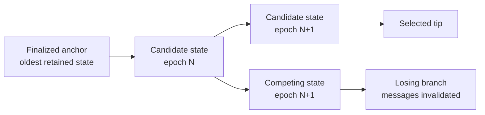
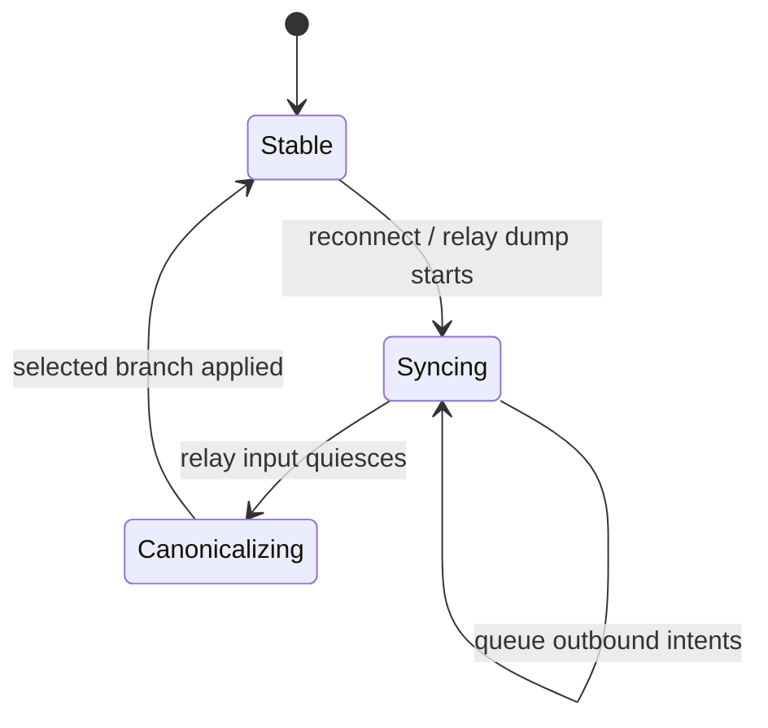
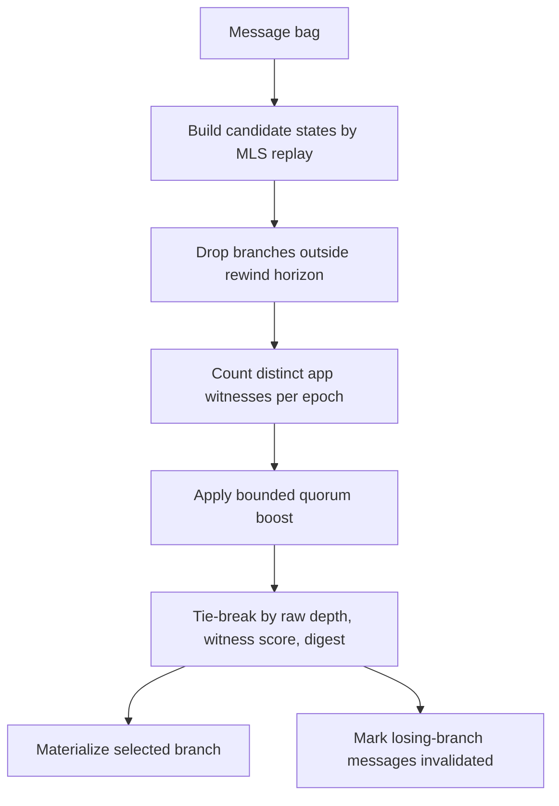

# Distributed Convergence

**Status:** design draft. This is the target model for Marmot clients that need
to converge on one MLS group state from unordered multi-relay input.

The engine contract that packages this model as a state-machine operation lives
in
[`cgka-engine-canonicalization-contract.md`](./cgka-engine-canonicalization-contract.md).

## Problem

Marmot commits are the consensus log. Every honest client that receives the
same set of valid messages should select the same commit sequence and reach the
same MLS epoch and group state.

Application messages are not part of the consensus log. They are processed in
the epoch they belong to, then the application orders payloads with its own
message timestamp. Application messages can still witness that a branch was
used by real group members.

The hard case is a returning client that fetches a bag of messages from several
relays:

- some commits are from the live branch,
- some commits are from branches the group later abandoned,
- some valid commits may have been created offline and published late,
- relay order and local arrival order are not correctness inputs.

The engine must choose a canonical branch from protocol evidence, not from
Nostr `created_at`, outer event ids, or local first-seen time.

## Shape

The engine keeps a bounded candidate-state graph. The live `MlsGroup` is a
materialized view of the selected branch.



Graph terms:

- **Finalized anchor:** oldest retained group state usable as a rollback
  parent.
- **Candidate state:** materialized MLS state at an epoch, derived by applying
  valid commits from the anchor.
- **Edge:** commit that validates against exactly one parent candidate state.
- **Commit depth:** number of valid commits from fork epoch to branch tip.
- **App witness:** valid app message that decrypts against a candidate state.

Edges are discovered by replay. A v0.1 commit does not need an explicit parent
pointer.

## Sync Lifecycle



During `Syncing`, outbound app messages and group changes are queued as local
intents. App-message intents are encrypted after sync against the selected
canonical state. Commit intents are regenerated after sync because any pending
MLS state created before sync may have been based on a stale epoch.

## Branch Selection

Only eligible branches are scored.

```text
eligible =
  current_tip_epoch - branch.fork_epoch <= max_rewind_commits
```

Witness score counts distinct senders per epoch:

```text
app_witness_score =
  sum over epochs:
    min(distinct_valid_app_senders_at_epoch,
        witness_quorum_senders_per_epoch)
```

A branch meets witness quorum when at least
`witness_quorum_senders_per_epoch` distinct senders produced valid app messages
on at least `witness_quorum_epochs` branch epochs.

```text
effective_commit_depth =
  valid_commit_depth
  + (witness_quorum_met ? max_witness_override_depth : 0)
```

Branches are compared in this order:

1. Higher `effective_commit_depth`.
2. Witness quorum beats no quorum.
3. Higher `valid_commit_depth`.
4. Higher `app_witness_score`.
5. Lower tip commit digest.



This lets a broadly used live branch beat a private branch that is only a few
commits longer. It does not let app traffic defeat an arbitrarily longer valid
branch. Counting distinct senders per epoch prevents one sender from winning
with message volume.

## Policy

The convergence policy should be group-negotiated. Working defaults:

```text
convergence_policy = {
  max_rewind_commits: 5,
  witness_quorum_senders_per_epoch: <group policy>,
  witness_quorum_epochs: <group policy>,
  max_witness_override_depth: <group policy>,
}
```

`max_rewind_commits` also bounds snapshot retention, so the forward-secrecy
cost is explicit. Once MLS app components are available, the policy should live
there. Until then, Marmot can carry it in a group context extension and treat an
unsupported policy as a capability mismatch.

## Examples

### Equal-depth fork

Two branches both have depth 2. One branch has app witnesses from more distinct
members. The witnessed branch wins before digest tie-break.

### Withheld private branch

The live branch has 3 commits and witness quorum across 2 epochs. A private
branch later publishes 5 commits from the same fork. If
`max_witness_override_depth = 2`, the live branch receives a bounded boost and
wins the tie:

```text
live:     depth 3 + quorum boost 2 = effective 5
private:  depth 5 + quorum boost 0 = effective 5
winner:   live branch, because quorum beats no quorum
```

### Longer valid branch

The live branch has 3 commits plus quorum boost 2. A competing branch has 6
valid commits. The longer branch wins:

```text
live:      effective 5
competing: effective 6
winner:    competing branch
```

The quorum boost protects against short private branch dumps. It is not a way
for application traffic to overrule any valid branch.

## Current Implementation Target

The executable policy model lives in
[`crates/cgka-engine/src/convergence.rs`](../../crates/cgka-engine/src/convergence.rs).
The model tests live in
[`crates/cgka-conformance/tests/candidate_state_graph.rs`](../../crates/cgka-conformance/tests/candidate_state_graph.rs).
The executable canonicalization contract model lives in
[`crates/cgka-engine/src/canonicalization.rs`](../../crates/cgka-engine/src/canonicalization.rs).
That model now materializes symbolic commit edges into candidate branches before
calling the branch selector.

Those tests cover:

- equal-depth fork resolved by app witnesses,
- quorum overriding a small commit-depth lead,
- quorum failing to override a larger commit-depth lead,
- distinct senders counted per epoch,
- stale branch rejected by rewind horizon,
- digest as final tie-break.

The current engine still has single-rollback fork recovery. The next engine
step is to replace that path with candidate-state graph materialization.

## Formal Verification

Tamarin is a good fit for the security-adjacent part of this model if we keep
the first model small.

The initial scaffold lives in
[`formal/tamarin/distributed_convergence_v0.spthy`](../../formal/tamarin/distributed_convergence_v0.spthy).
It models the selector boundary only: two honest clients, the same valid
candidate set, the same negotiated policy, and deterministic branch selection.
Scores are represented as bounded symbolic classes so the model can prove the
comparison order without modeling MLS internals.

Model first:

- commits as signed facts with `group`, `source_epoch`, `tip_epoch`, `sender`,
  and `digest`;
- app witnesses as authenticated facts tied to a branch epoch and sender;
- a bounded policy fact containing rewind horizon and quorum thresholds;
- adversary control over delivery order, withholding, duplication, and replay;
- honest clients applying the same deterministic `select` relation.

Initial lemmas:

1. **Deterministic convergence:** two honest clients with the same valid input
   set and policy select the same branch.
2. **Rewind bound:** no selected branch forks earlier than
   `max_rewind_commits`.
3. **Bounded witness override:** app witnesses cannot override more than
   `max_witness_override_depth` commits.
4. **Spam resistance:** multiple app witnesses from the same sender in one
   epoch count once.
5. **Outbound gate:** outbound intents queue while convergence is syncing and
   release only after the stability gate opens.
6. **Three-branch convergence:** clients that enumerate the same three
   candidate branches in different orders select the same winner.
7. **Late withheld commit rejection:** a branch published after the retained
   anchor is rejected when its rewind distance exceeds policy.
8. **Bounded policy seeds:** generated-family seed cases select the expected
   winner and reason.

The v0 model currently verifies deterministic selection, eligible-only
selection, score-order justifications, stale-rewind rejection derived from
anchor/distance facts, sender/epoch witness dedupe, queued outbound gating,
three-branch permutations, late withheld publication after anchor, generated
bounded seed cases, and executable traces for each modeled scenario.
The bounded seed source is
[`formal/tamarin/policy_cases.json`](../../formal/tamarin/policy_cases.json);
`cgka-policy-casegen` emits matching Tamarin seed rules from the same file that
Rust selector tests consume.

The proof-to-test workflow is documented in
[`formal/tamarin/README.md`](../../formal/tamarin/README.md). Tamarin captures
the abstract convergence design; Rust unit, property, and scenario tests check
that the implementation follows it.

Leave full MLS cryptography abstract in the first model. Tamarin should reason
about ordering, eligibility, and adversarial message scheduling. The Rust tests
and OpenMLS integration cover implementation details.
