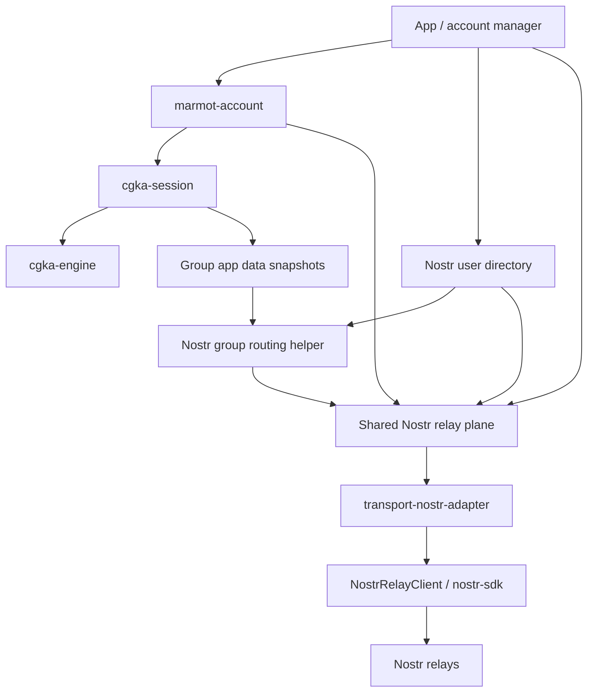

# Nostr Account Transport Notes

This note captures the current account-transport shape without turning this repository into the whole Nostr app core.

The near-term priority remains the CGKA engine: clean engine boundaries, strong chaos coverage, and portable vectors.
Nostr account transport work should support that goal by making the eventual whitenoise-rs integration clearer.

## Three Nostr Roles

Nostr has three separate roles in Marmot:

1. Identity. A Marmot user is identified by a Nostr pubkey. This is expected to stay fixed because it gives Marmot
   account identity, social discovery, and relay-discoverable user state.
2. Application message shape. The MLS-encrypted application payload uses an unsigned Nostr event shape.
3. Transport. Nostr relays are the first transport for MLS ciphertext, welcomes, KeyPackages, relay lists, and related
   account state.

The identity role is not expected to change. The transport role should remain replaceable.

## Account Transport Subsystems

The Nostr account transport layer should be split into four pieces.

### Nostr User Directory

The user directory is the warm local cache for Nostr identity data.

It should track:

- users keyed by Nostr pubkey;
- local accounts linked to those users;
- follow lists and follower-derived user records;
- mute lists and relay block decisions;
- profile metadata needed by the app;
- NIP-65 relay lists;
- inbox relay lists;
- kind `10051` KeyPackage relay lists.

This is close to the shape whitenoise-rs already has: users and accounts are different records, with relationship and
relay data kept fresh in the background.

### Account Bootstrap

When creating or signing in to a Nostr-backed Marmot account, the app must ensure required account-published state
exists.

For the current Marmot design that includes:

- a NIP-65 relay list;
- an inbox relay list for welcome gift wraps;
- a kind `10051` KeyPackage relay list;
- enough local directory state to publish welcomes and KeyPackages correctly.

Missing kind `10051` should be handled by account setup. It should not become a permanent runtime mystery for KeyPackage
publication.

### Shared Relay Plane

The relay plane owns relay connections and subscriptions across all local accounts.

It should:

- dedupe relay connections across accounts;
- dedupe compatible subscriptions where possible;
- keep account-aware delivery metadata;
- subscribe to each account's inbox relays for welcomes;
- subscribe to group relays for every active group on every account;
- publish group messages to group relays;
- publish KeyPackages to relays from kind `10051`;
- publish account relay-list events during bootstrap and updates.

Multi-account dedupe belongs here, below `marmot-account`. The account runtime should not need a global view of every
local account.

### Marmot Nostr Group Routing

Group message routing for Nostr-routed Marmot groups comes from signed MLS group state.

The source of truth is:

- `marmot.transport.nostr.routing.v1`

The routing helper should parse the current component state, validate update payloads, and project the component into:

- group subscriptions;
- group-message publish targets;
- relay-list update validation errors.

There should be no legacy group routing source for new work.

## Relay Safety Policy

Relay lists in the wild contain bad data. Local clients need a safety policy before connecting or publishing.

The policy should be explicit and testable:

- require valid relay URLs;
- prefer `wss://` by default;
- reject malformed URLs;
- reject duplicate relay URLs after normalization rules are applied;
- cap relay counts;
- block known dead or abusive relays;
- track runtime relay health separately from signed group state.

Filtering runtime connections must not rewrite signed MLS group state. A client may decide not to connect to a relay
from a group component, but that decision is local policy.

## Boundary Sketch

`marmot-account` coordinates account-device work. It should stay transport-generic.

Nostr-specific directory state, relay-list publication, relay safety, and multi-account subscription dedupe belong in
the Nostr account transport layer.

## Near-Term Use

This note should guide the next interface design, but it should not expand the scope of this repository into a full
application core.

The next Nostr-facing code should be small:

- parse and validate `marmot.transport.nostr.routing.v1`;
- project routing state into group subscriptions and publish targets;
- define how a Nostr-backed service publishes kind `30443` KeyPackages using kind `10051` relay-list data.

The engine work remains the center of gravity.
